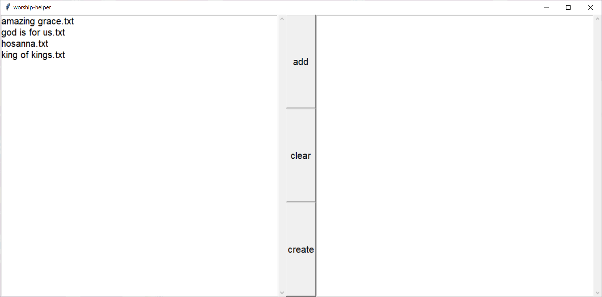

# WORSHIP-HELPER

Helper program for creating worship presentations for lyrics.

# HOW IT WORKS
Uses reveal.js as the platform to display our presentations.

Worship-helper reads in text files of song lyrics and
creates a html which is usable with reveal.js.

# REQUIREMENTS
- [reveal.js](https://github.com/hakimel/reveal.js/)
- Python - MAC and LINUX only

# INSTALLATION
Download the latest [release](https://github.com/eldon-yeh/worship-helper/releases/).
Extract the files into your reveal.js installation folder.

# USAGE
- For windows users
  - run worship-helper.exe
- For linux/mac
  - download the source and run worship-helper.pyw through python
- Select and add desired songs, then click create
- Then open the output.html in your browser (internet is not required)

Put your text files with song lyrics into the songs folder.

## SONG LYRIC FILE STRUCTURE
Songs lyrics are saved in text files, some have been provided
already in the songs folder and you can easily create your own.

- __The first line in your text file should be the title of the song.__
- Leave __one__ blank line between paragraphs where you want a new slide
to start
  - __do not__ use more than one blank line in a row.

# CUSTOMISATION
The presentation can be customized by editing tail.html.

# TODO
- web scraping for lyrics.
- ~~gui~~ done
